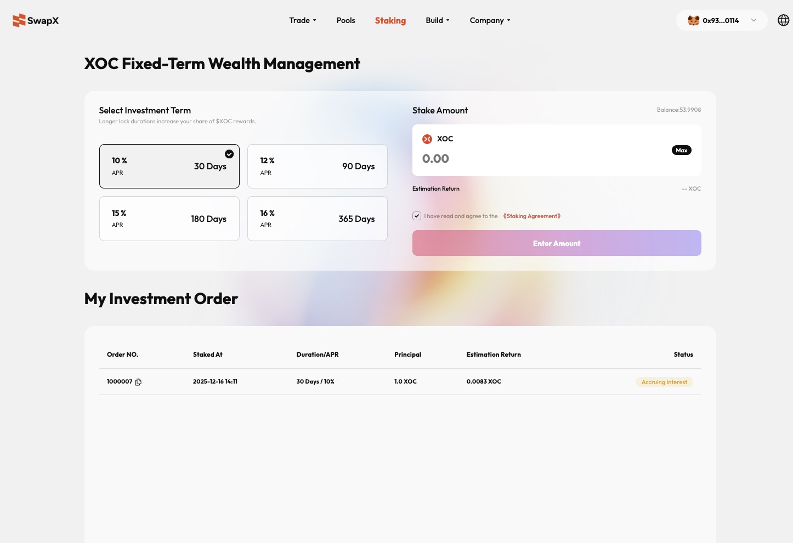
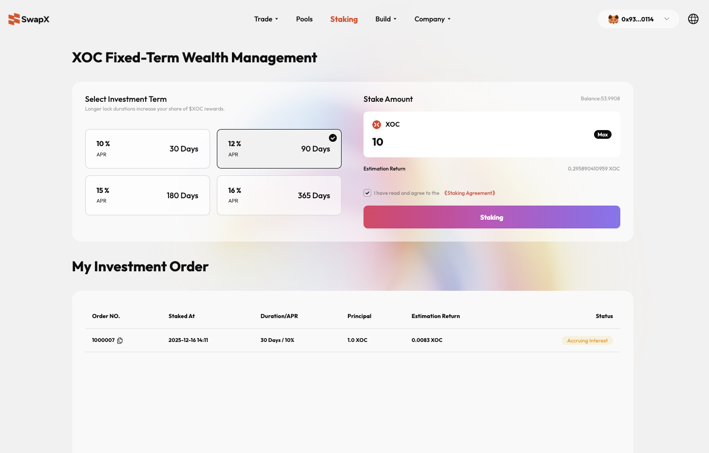
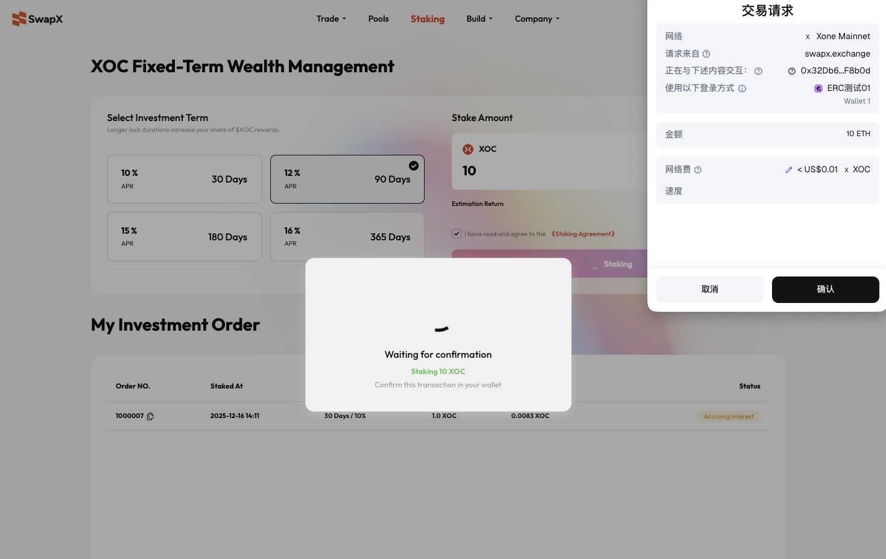

# ⭐️SwapX-XOC Staking Guide

Welcome to **SwapX Fixed-Term Staking**. By staking your **XOC** tokens, you can earn competitive Annual Percentage Rates (APR) based on your chosen lock-up period.

---

## 🚀 Operation Steps

### 1. Access Staking & Connect Wallet
* Navigate to the [SwapX Official Website](https://swapx.ai).
* Click **"Staking"** in the top navigation bar to enter the financial management page.
* Click the **"Connect Wallet"** button (e.g., MetaMask) in the top right corner. 
* Once connected, your wallet address and **XOC** balance will be displayed on the interface.
    

### 2. Select Staking Term
In the **"Select Investment Term"** module, choose a plan that fits your financial strategy. Generally, a longer lock-up period yields a higher APR:

| Duration | APR |
| :--- | :--- |
| 30 Days | 10% |
| 90 Days | 12% |
| 180 Days | 15% |
| 365 Days | 16% |

:::tip UI Hint
The selected term will be highlighted with a **dark border** and a **checkmark icon**.
:::
    

### 3. Enter Staking Amount
* Locate the **"Staking Amount"** input field on the right.
* Enter the amount of **XOC** you wish to stake, or click **"Max"** to stake your entire balance.
* The system will automatically display the **"Estimation Return"** below the input field.
    

### 4. Confirm & Sign
* Check the box: **"I have read and agree to the \<Staking Agreement\>"**.
* Click the **"Staking"** button (or "Enter Amount" if the field is empty).
* Your wallet (e.g., MetaMask) will prompt a contract interaction window. Verify the transaction details and click **"Confirm"**.
* Wait for the blockchain network confirmation. Once finalized, your staking is successful.
    

---

## 📊 Managing Your Portfolio

After a successful stake, you can monitor your assets in the **"My Investment Order"** section at the bottom of the page:

* **Order ID:** The unique identifier for each staking transaction.
* **Staking Time:** The specific date and time the stake was initiated.
* **Term / APR:** The lock-up duration and the corresponding yield rate.
* **Principal:** The total amount of **XOC** staked.
* **Estimated Return:** The projected rewards available upon maturity.
* **Status:** * **Accruing Interest:** The order is active, and funds are currently locked.

---

## ⚠️ Important Notes

:::warning Fixed-Term Lock-up
Funds in fixed-term staking **cannot be withdrawn early**. Please ensure you select a duration that aligns with your liquidity needs.
:::

:::info Gas Fees
Staking operations require a small amount of network fees (Gas Fees). Please ensure your wallet contains sufficient native tokens to cover these costs.
:::

[📜 XOC Staking Agreement](../welcome-to-swapx/privacy-and-terms/XOCStaking.md)