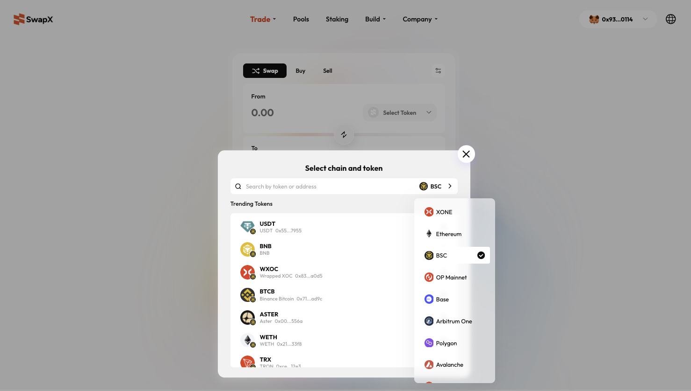
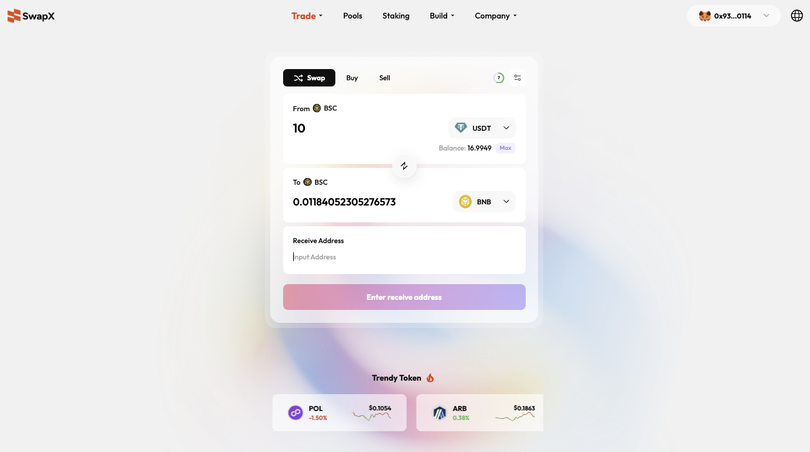
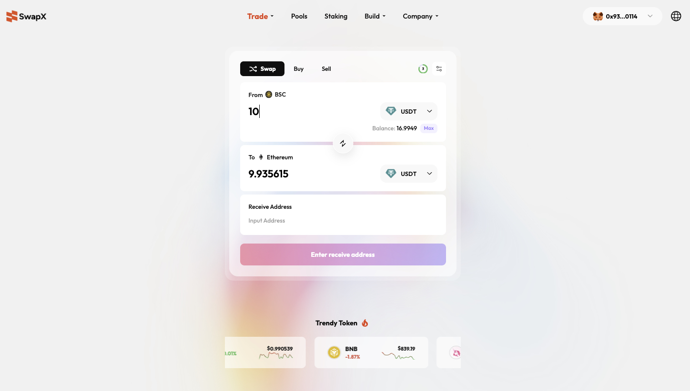

# 🤝 LIFI aggregation access

## 1. 📖 Overview

[SwapX](https://swapx.exchange/) integrates the **[LiFi](https://li.fi/)** aggregated liquidity platform to provide a superior trading experience.

By leveraging Li.Fi’s robust cross-chain infrastructure, [SwapX](https://swapx.exchange/) breaks down the traditional "silo effect" between blockchains, achieving **full-chain interoperability**. Users no longer need to switch between different bridges and decentralized exchanges (DEXs). Within the single [SwapX](https://swapx.exchange/) interface, you can complete seamless transfers and swaps of multi-chain assets.

Whether it is a **same-chain token swap** or a **cross-chain asset migration** (e.g., from Xone Chain to BSC, or BSC to Ethereum), it can be completed with just one click.

---

## 2. Key Features ✨

### 2.1 Aggregated Liquidity & Multi-Chain Support
* **Technical Foundation:** Powered by the Li.Fi protocol, [SwapX](https://swapx.exchange/) aggregates liquidity from major cross-chain bridges and DEXs to find the optimal swap path and exchange rate for users.
* **Extensive Ecosystem:** Supports asset interoperability across a vast range of mainstream and emerging public chains.

| Category | Supported Chains |
| :--- | :--- |
| **Layer 1** | Ethereum, BSC, Avalanche, Polygon, TRON  |
| **Layer 2** | Xone, Arbitrum One, OP Mainnet, Base|

> **Use Case:** Users can easily swap USDT on the **XONE Chain** for USDT on **BSC**, or bridge USDT from **BSC** to **Ethereum**.

### 2.2 Seamless Cross-Chain Swaps
* **Atomic Transactions:** Combines "Asset Bridging" and "Token Swapping" into a single step. Set your source and destination; the system automatically handles bridging and swapping in the background.
* **Flexible Recipient Addresses:** Supports specifying a destination address during the transaction. You can swap to your current wallet or send directly to a different address.

---

## 3. Step-by-Step User Guide 🚀

Follow these steps to perform a cross-chain or same-chain swap on [SwapX](https://swapx.exchange/):

### Step 1: Select Chain & Token ⛓️
Navigate to the [SwapX](https://swapx.exchange/) homepage and click the **"Swap"** tab.
1.  **Set Source (From):** Click the dropdown to select the chain (e.g., BSC) and the token (e.g., USDT) you currently hold.
2.  **Set Destination (To):** Click the dropdown to select the target chain (e.g., Ethereum) and the desired token (e.g., USDT).
3.  **Interface Note:** Clicking the token selector opens the "Select Chain and Token" list, allowing searches by token name or address across supported chains like XONE, Ethereum, and BSC.
    

### Step 2: Enter Amount 🔢
Input the quantity you wish to swap in the "From" section.
* The system automatically reads your wallet balance.
* Use the **"Max"** button to quickly fill in your entire balance.
* **Real-time Calculation:** Based on the Li.Fi path, the system calculates and displays the estimated receiving amount instantly.
    

### Step 3: Confirm Recipient Information 👤
* **Recipient Address:** A field is provided at the bottom of the interface.
* **Self-Swap:** Ensure the address matches your currently connected wallet.
* **External Transfer:** If sending to another person or an exchange, paste the destination wallet address into the **"Enter Address"** field.
* *Example:* When swapping 100 USDT (BSC) to Ethereum, the UI clearly displays the estimated 99.44 USDT arrival after accounting for cross-chain slippage/fees.
    

### Step 4: Execute Transaction ✅
1.  Review the route (e.g., BSC -> Ethereum), amount, and exchange rate.
2.  Click the **"Enter Recipient Address"** or **"Swap"** button (depending on current status).
3.  Sign and confirm the transaction in your wallet extension.
4.  **Completion:** Wait for on-chain confirmation. Assets will automatically arrive at the destination address on the target chain.